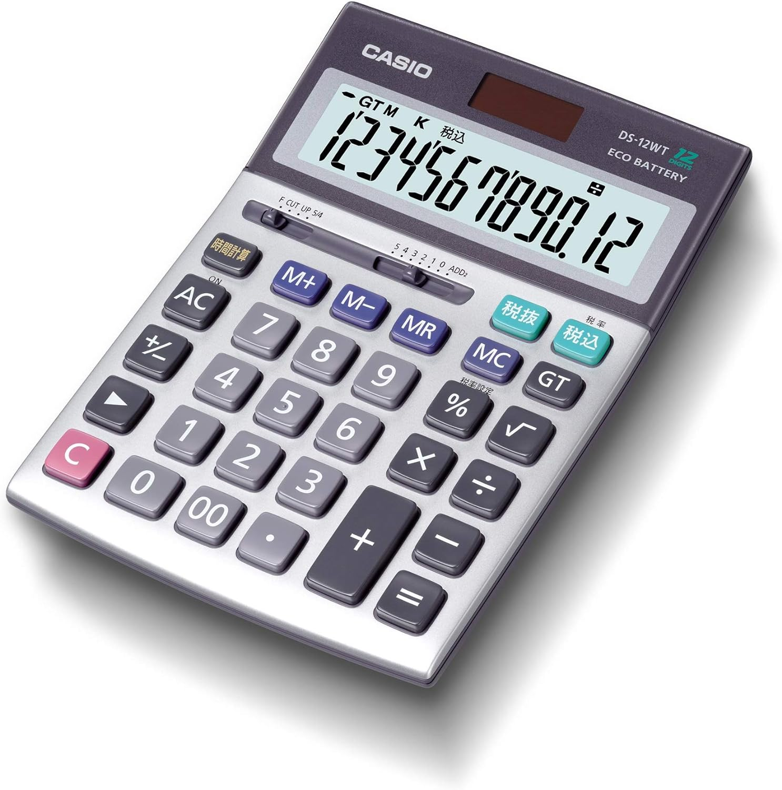

#PHP、Javascriptを使っている電卓

[ここで使ってみてください](http://dentaku.ap-northeast-3.elasticbeanstalk.com/dentaku.html)

##どうしてPHP？

課題にそれが必要でした。インタネットによくある電卓はサーバーで計算しません。「どうやってPHPを使うべきか」を考えて、APIとして使おうと思っていました。
入力してから、ページがサーバーに数と演算を送ります。サーバーが精算して、答えをまたクライエントに送ります。
メモリ機能はクライエントで管理されています。

##どんな電卓をマネしましたか？

このCASIO DS-12WT。

私は「どんな機能が必要ですか」を聞いて、「”電卓” の範囲理解は、実施者にお任せしています。」と答えました。でも実は家で本物の電卓がなくて、パソコンの電卓プログラムしかなかったです。「電卓」をネットで調べて、この画像に基づくことになりました。
